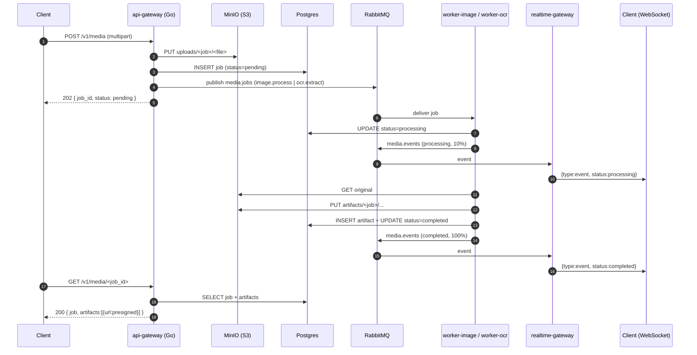

# MediaForge — Architecture

MediaForge is a polyglot, event-driven media-processing platform. This document
describes the runtime topology, the message contracts that bind the services
together, and the reliability mechanics (retries, dead-lettering, idempotency,
scaling, graceful shutdown).

## 1. Services

| Service | Lang | Responsibility | Scales on |
|---|---|---|---|
| `api-gateway` | Go | Ingest uploads, persist jobs, publish work, serve status | HTTP CPU |
| `worker-image` | Go | Resize / thumbnail / WebP transcode | CPU + queue depth |
| `worker-ocr` | Python | Tesseract OCR text extraction | CPU |
| `realtime-gateway` | TypeScript | WebSocket fan-out of job events | connections |

Backing infrastructure: **PostgreSQL** (job + artifact metadata), **Redis**
(rate limiting), **RabbitMQ** (work + event bus), **MinIO/S3** (object storage),
**Prometheus + Grafana** (observability).

## 2. Request lifecycle



## 3. Message contracts

All messages are JSON. The canonical Go definition lives in
`services/api-gateway/internal/media/contract.go`; the workers carry mirrored
structs (`worker-image/internal/broker`, `worker-ocr/.../broker.py`).

### Job (published on `media.jobs`)

```json
{
  "job_id": "uuid",
  "kind": "image | ocr",
  "status": "pending",
  "source_key": "uploads/<job_id>/<filename>",
  "source_mime": "image/png",
  "size_bytes": 12345,
  "operations": ["resize", "thumbnail", "webp", "grayscale"]
}
```

Routing keys on the `media.jobs` topic exchange:

- `image.process` → `q.image`
- `ocr.extract` → `q.ocr`

### Event (published on `media.events`)

```json
{
  "job_id": "uuid",
  "kind": "image",
  "status": "processing | completed | failed",
  "message": "human-readable",
  "progress": 0,
  "artifact": "thumbnail",
  "ts": 1730000000000
}
```

Routing key: `event.<kind>`. The realtime-gateway binds with `event.#`.

## 4. Reliability: retries, DLQ, idempotency

### Topology

```
media.jobs (topic) ──image.process──▶ q.image  (quorum, DLX=media.jobs.dlx)
                   └─ocr.extract────▶ q.ocr    (quorum, DLX=media.jobs.dlx)

media.jobs.dlx (topic) ──#──▶ q.retry (TTL=10s, DLX=media.jobs)
media.jobs.parking (topic) ──#──▶ q.parking (terminal DLQ)
```

### Retry loop

1. A worker `nack`s a failed message with `requeue=false`.
2. RabbitMQ dead-letters it to `media.jobs.dlx` → `q.retry`.
3. `q.retry` holds the message for its TTL, then dead-letters it **back** to
   `media.jobs`, where it is redelivered to a worker.
4. Each hop increments the `x-death` header `count`. Workers read that count as
   the attempt number.
5. After `RABBITMQ_MAX_RETRIES` attempts the worker republishes the message to
   `media.jobs.parking` (the parking lot) and acks the original — stopping the
   loop. Parked messages carry an `x-parking-reason` header for triage.

This gives **bounded, delayed, at-least-once** processing without a scheduler.

### Idempotency

Every job has a stable UUID. Before doing work, a worker checks the job's status
in Postgres and **skips** anything already `completed`. Artifact writes use
`INSERT ... ON CONFLICT (job_id, name) DO UPDATE`, so re-processing is safe.
Combined, redeliveries never produce duplicate or corrupt output.

### Publisher guarantees

The gateway publishes in **confirm mode** and waits for the broker ack before
returning `202`, so a job is never lost between "client got 202" and "message on
the queue".

## 5. Scaling model

- **Stateless everything.** No service holds session state; the realtime-gateway
  keeps only in-memory subscriptions, and every replica receives every event
  (exclusive per-replica queue bound to `media.events`), so any replica can
  serve any client.
- **Workers scale horizontally.** Add pods to drain `q.image` / `q.ocr` faster.
  The `worker-image` HPA scales on CPU **and** on `rabbitmq_queue_messages_ready`
  (via the Prometheus adapter), so the fleet tracks backlog, not just CPU.
- **Quorum queues** keep work durable across broker node failures.

## 6. Graceful shutdown

On `SIGTERM` (sent by Kubernetes before pod deletion):

- The gateway stops accepting connections and drains in-flight HTTP requests.
- Workers stop consuming, finish the message in hand, and close the channel;
  unacked messages are redelivered elsewhere.
- `terminationGracePeriodSeconds: 60` gives in-flight jobs room to complete.

## 7. Observability

Every service exposes Prometheus metrics (`/metrics`) following the RED method.
Key series: `mediaforge_api_http_requests_total`,
`mediaforge_api_jobs_published_total`,
`mediaforge_image_worker_job_duration_seconds`,
`mediaforge_*_worker_jobs_processed_total{outcome=...}`,
`mediaforge_realtime_connected_clients`. A Grafana dashboard and Prometheus
alert rules ship in `observability/`.

### Distributed tracing

Metrics tell you *that* something is slow; traces tell you *where*. Every
service is instrumented with **OpenTelemetry** and a single trace follows a
request across process and language boundaries:

```
HTTP POST /v1/media ─▶ api-gateway (Go) ─publish─▶ RabbitMQ ─▶ worker (Go/Py)
                                                                    │ publish
                                                                    ▼
                                                  RabbitMQ ─▶ realtime-gateway (TS)
```

The trick across the message bus is **context propagation**: the gateway injects
the W3C `traceparent` into the AMQP message headers on publish; each worker
extracts it and starts its span as a child, so the broker hop doesn't break the
trace. The worker re-injects context onto the `media.events` message, so the
realtime-gateway's WebSocket fan-out is the trace's final span.

Spans are exported via **OTLP** (Go services over gRPC `:4317`; Python and Node
over HTTP `:4318`) to an **OpenTelemetry Collector**, which batches and forwards
them to **Jaeger** (`:16686`). Routing through the collector means swapping the
trace backend (Tempo, an APM SaaS, …) is a one-line change in
`observability/otel-collector/config.yaml` — the services never change. Jaeger is
also wired as a Grafana datasource. Tracing is gated by `OTEL_TRACES_ENABLED`
and sampled by `OTEL_TRACES_SAMPLE_RATIO`; even when export is off the propagator
stays installed so context keeps flowing.

### Log ↔ trace correlation

Every log line emitted while a span is active carries `trace_id` and `span_id`,
so a log and the trace it belongs to are cross-navigable — the third
observability pillar joined to the other two. The Go services wrap their `slog`
handler to read the span from the request/job context (logs use the `*Context`
methods); the Python worker installs a log-record factory; the Node gateway
reads the active span. From a failing log you can jump straight to the trace that
produced it, and vice-versa.
